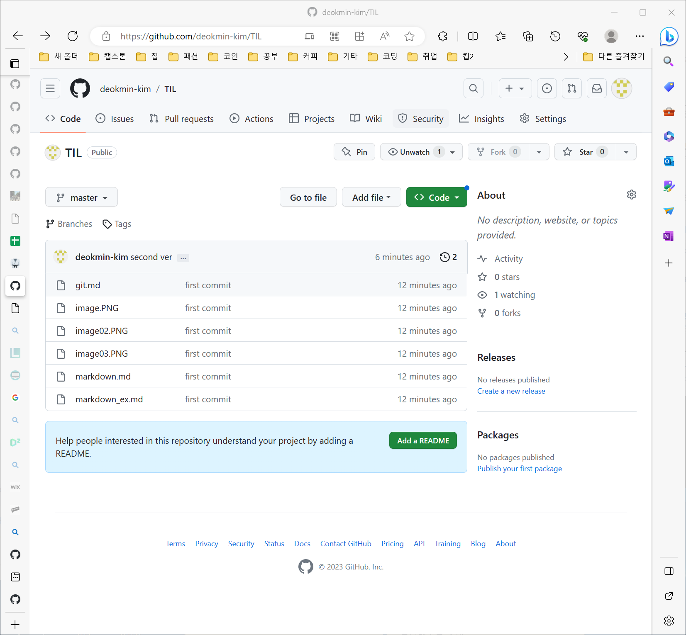
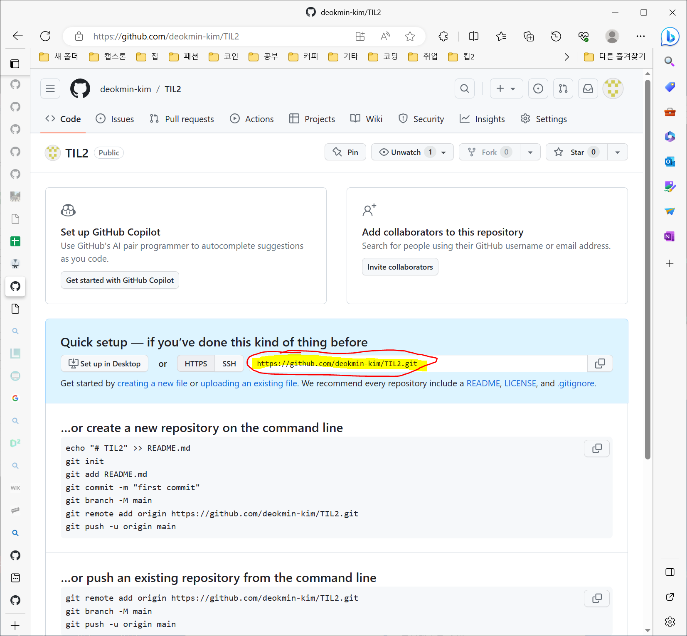

## Git CLI 
```bash
deokmin kim@DESKTOP-4KSU85J MINGW64 /c/Users/deokmin kim/Desktop/markdown

$ ls
git.md     image02.PNG  main.py      markdown_ex.md
image.PNG  image03.PNG  markdown.md


deokmin kim@DESKTOP-4KSU85J MINGW64 /c/Users/deokmin kim/Desktop/markdown
$ touch 2.txt


deokmin kim@DESKTOP-4KSU85J MINGW64 /c/Users/deokmin kim/Desktop/markdown
$ rm 2.txt


deokmin kim@DESKTOP-4KSU85J MINGW64 /c/Users/deokmin kim/Desktop/markdown
$ mkdir 2

```

### CLI 기본구성요소
- ~ : 홈 디렉토리

### 명령어 기본 구조
- 기초 파일 시스템 명령어


## 버전관리의 의미
**버전관리란?**
- 버전 : 컴퓨터 소프트웨어의 특정 상태


## Git 버전관리 실습

- 작업 영역에 git 초기화
```bash
 $ git init
```

```bash
deokmin kim@DESKTOP-4KSU85J MINGW64 /c/Users/deokmin kim/Desktop/TIL (master)
$ git status
On branch master

No commits yet

Untracked files:
  (use "git add <file>..." to include in what will be committed)
        23.PNG
        git.md
        image.PNG
        image02.PNG
        image03.PNG
        markdown.md
        markdown_ex.md

nothing added to commit but untracked files present (use "git add" to track)

```

기존 로컬에 있던 파일들 git버전에 올리기
```bash
#staging
$ git add . 

#commit
$ git commit
#or $ git commit -m 'message'
```

* 깃허브 페이지 접속



-> 우측 상단 + 눌러서 new repository 생성

<br>
<br>



<br>

-> 해당 주소 복사한 뒤, git bash에서 

```bash
# git 로컬저장소와 github연동
$ git remote add origin https://github.com/deokmin-kim/TIL.git


deokmin kim@DESKTOP-4KSU85J MINGW64 /c/Users/deokmin kim/Desktop/TIL (master)
$ git remote -v
origin  https://github.com/deokmin-kim/TIL.git (fetch)
origin  https://github.com/deokmin-kim/TIL.git (push)
```

마지막으로 git push를 통해 github레포지토리에 현재버전 push한다.

```bash
deokmin kim@DESKTOP-4KSU85J MINGW64 /c/Users/deokmin kim/Desktop/TIL (master)
$ git push origin master
Enumerating objects: 9, done.
```