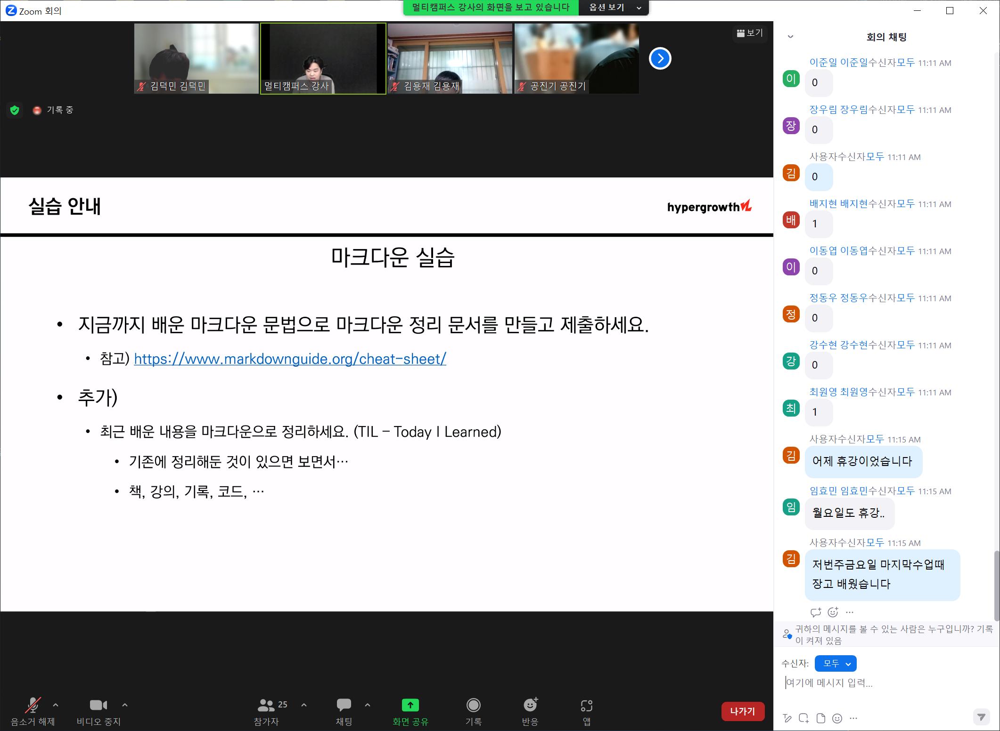

## Git CLI 
```bash
deokmin kim@DESKTOP-4KSU85J MINGW64 /c/Users/deokmin kim/Desktop/markdown

$ ls
git.md     image02.PNG  main.py      markdown_ex.md
image.PNG  image03.PNG  markdown.md


deokmin kim@DESKTOP-4KSU85J MINGW64 /c/Users/deokmin kim/Desktop/markdown
$ touch 2.txt


deokmin kim@DESKTOP-4KSU85J MINGW64 /c/Users/deokmin kim/Desktop/markdown
$ rm 2.txt


deokmin kim@DESKTOP-4KSU85J MINGW64 /c/Users/deokmin kim/Desktop/markdown
$ mkdir 2

```

### CLI 기본구성요소
- ~ : 홈 디렉토리

### 명령어 기본 구조
- 기초 파일 시스템 명령어


## 버전관리의 의미
**버전관리란?**
- 버전 : 컴퓨터 소프트웨어의 특정 상태


## Git 버전관리 실습

- 작업 영역에 git 초기화
```bash
 $ git init
```


