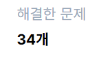

# 마크다운 학습

## 제목(heading)

 제목은 #으로 표현한다.

 ### h3
 #### h4
 ##### h5


 ## 목록

 - 사과
 - 배
 - 바나나
    - 바나나


## 코드 블록

``` python
print('hello world!')
# 주석
```

``` html
<h1>helloWorld!</h1>
<!-- 주석 -->
```


## 링크
[구글](https://google.com)

[파이썬코드](./main.py)

=> 상대경로도 가능하기 때문에 목차를 통한 링크구성도 가능

## 이미지




## 인용문
> 인용구


## 테이블
- 타이포라 사용하면 편하다. but 유료 전환


|이름|나이|
|----|-----|
|어쩌구|저쩌구|


## 텍스트

*텍스트* **텍스트** ~~텍스트~~

italic 　　　  bold   &nbsp;                취소선